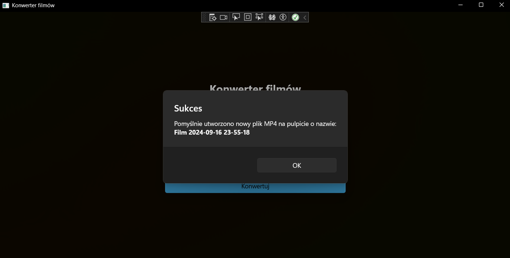

# Video Converter
Desktop app that lets you download YouTube videos, or TVP series episodes from an URL

## How to make it work?
Move previously downloaded `/bin` folder from https://ffmpeg.org/download.html to `/FFmpeg` directory (where the sample `/bin` folder is located).

## Screenshots
### Main menu

### Downloading Youtube video

### Downloading TVP video

### Finish message
